## Bashrc
R2R 실전편! Rush to ROS 

  

   
오늘은 영상 구독을 배웠어요.  
  
  
  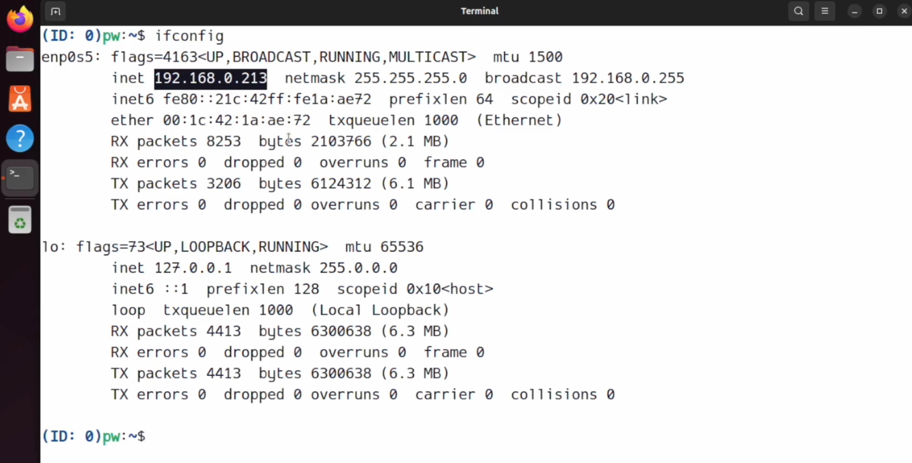 
일단 환경 셋팅! 강사님은 녹화용 mac pc 에서 ssh 로 ubuntu 에 접근을 하셨어요. 
ifconfig -> 192.168.0.213 ip를 알아냈어요.  
 
  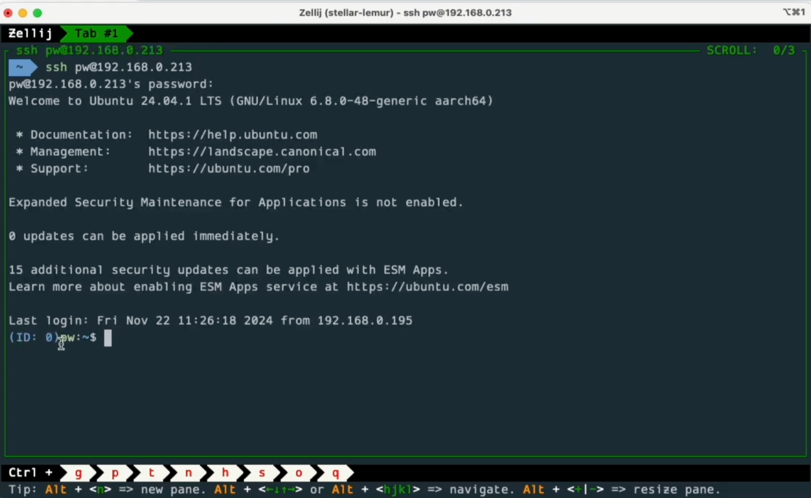 
암호 입력하고 접근한 ubuntu!
  
 
  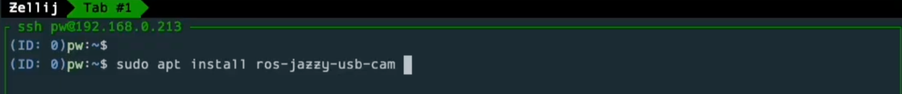 
  
여기에서 몇가지 설치했는데요, sudo apt install ros-jazzy-usb-cam
( ubuntu 24.04에서 jazzy를 설치 한 경우, j + tab ! )
이렇게 usbcam을 설치하면 됩니다. 
sbcam을 이미 설치했다면 아무것도 없다고  뜨구요, 
( ubuntu 22.02에서 humble을  설치 한 경우, jazzy 자리가 humble로 바뀌는 것 뿐!)

 

  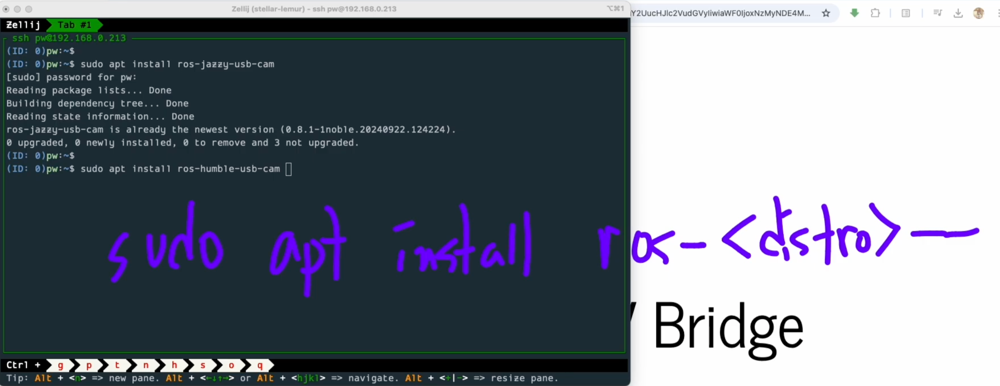 
보통 ROS 설치 가이드 페이지에 가면 이렇게 되어있는 경우가 많아요. 
sudo apt install ros- 한 다음에 <  distro >  해두고 샤랄랄라 적는 경우가 많아요,
 

   
ROS에서 usb카메라를 다루는 패키지가 있어요. usb cam 패키지.
 
   
ROS에서 이렇게 표기가 되어있으면, 꺾쇠 괄호부터 꺾쇠 괄호 닫히는 괄호 사이에 나만의 패키지를 넣으면 됩니다. 
< distro > 자리에 < ~~~ > 샤랄랄라 를 넣으면 되는거에요. 
  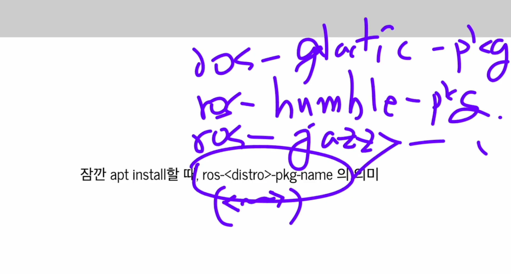 
  
ROS humble 사용자는 ros-humble-pkg 
ROS jazzy 사용자는 ros-jazzy-pkg
ROS galactic 사용자는 ros-galactic-pkg
이렇게 하면 되는거에요. ( 지원을 한다면! )

그런데! 그 패키지 만든 친구들이  지원을 해 주지 않으면 설치 안되는거라합니당...
  
  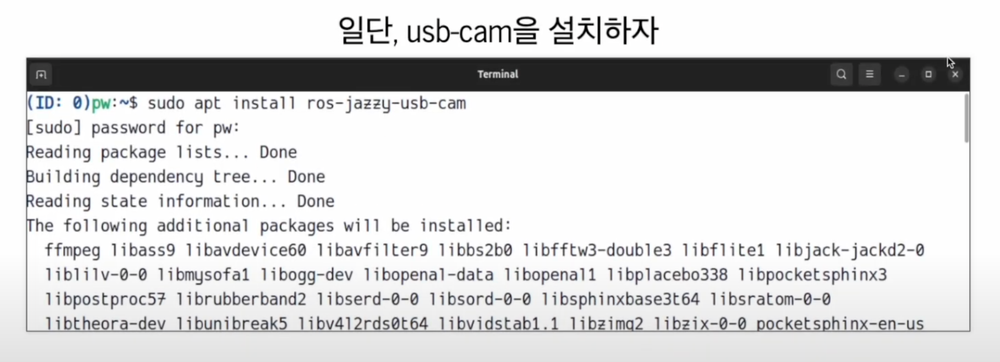 
  이렇게 해서 ROS jazzy usb cam 설치를 sudo apt install 명령으로 했어요. 

  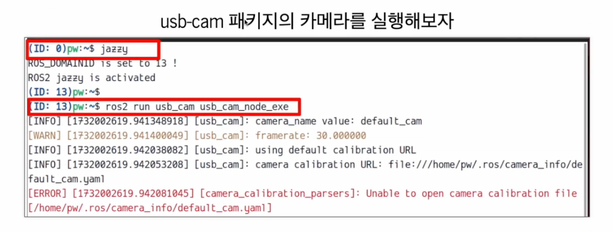 
이제 실행을 할거에요.( 카메라 켜질까봐 우려하셨던 강사님 키읔ㅋㅋ 수염 episode )

   
핑크램 유튜브 r2r 하면 여기 나와요. (되게되게 좋아하시던 .. -> "아 기분 되게 좋아요~" / ㅋㅋㅋㅋㅋ)
여기에서 bashrc 설정, 그 다음에 alias 설정 이라는 말이 있어요.

  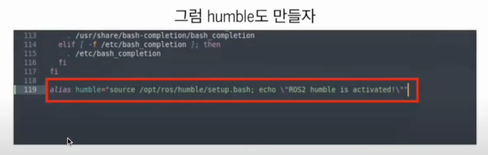 
alias 설정에서 강사님은 이렇게 맞추는 걸 좋아했어요. 

  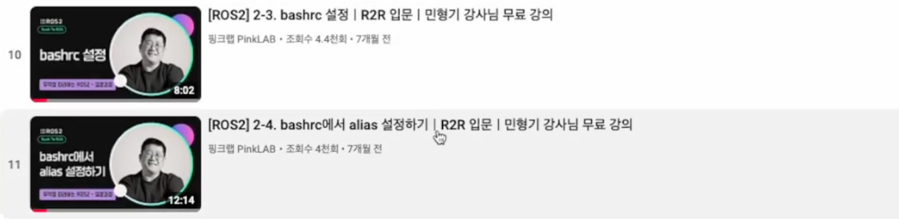   
(이 내용 잘 모르면 핑크랩 채널에 가셔서 2-4번 ROS2 bashrc 에서 alias 설정하기 찾아봐요!)
이 파일을 alias_settings.sh라고 두는거죠.

  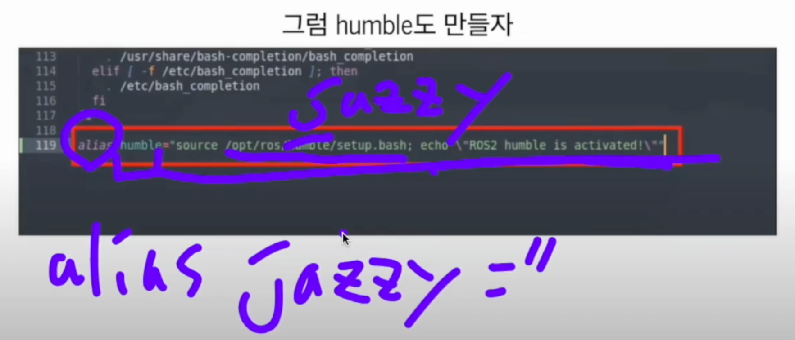 

이 내용을 좀 풀어서 보면 
alias라는걸 만드는데, humble이라는 이름으로 opt / ros / humble 경로에 있는 setup.bash를 부르구요, 
그리고 내가 무슨 짓을 했는지 echo 명령어로 print를 하죠. 
alias로 jazzy를 만들땐, humble 만 jazzy로 바꿔요. 나머지는 똑같아요.

   
jazzy로 바꾸서 실행 해 봤어요. 여기에서 jazzy 하고 부르면, 
ROS_DOMAINID 는 13번으로! (강사님이 좋아하는 숫자! 저의 생일도 13일이에요! 13은 제가 선점~ )
그리고 jazzy가 activated, 활성화 되었어요.
혹시 humble 버전으로 따라오고 계시면 humble 이라고 입력을 하셨겠죠~? 

  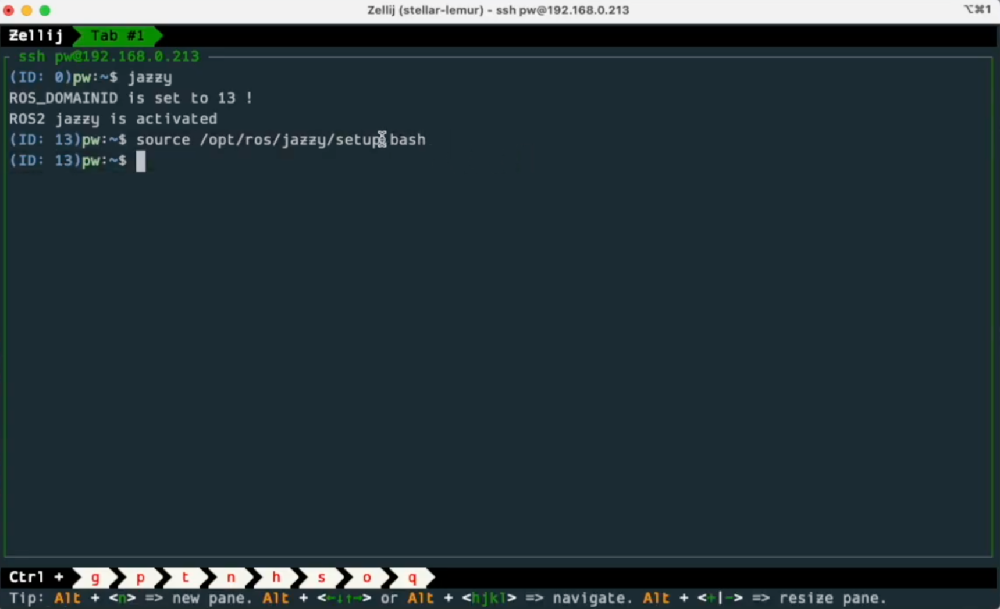 
jazzy로 진행 해 볼게요, source /opt/ros/jazzy (이 pc, 이 영상에서는 ubuntu 24.04의 jazzy!)

  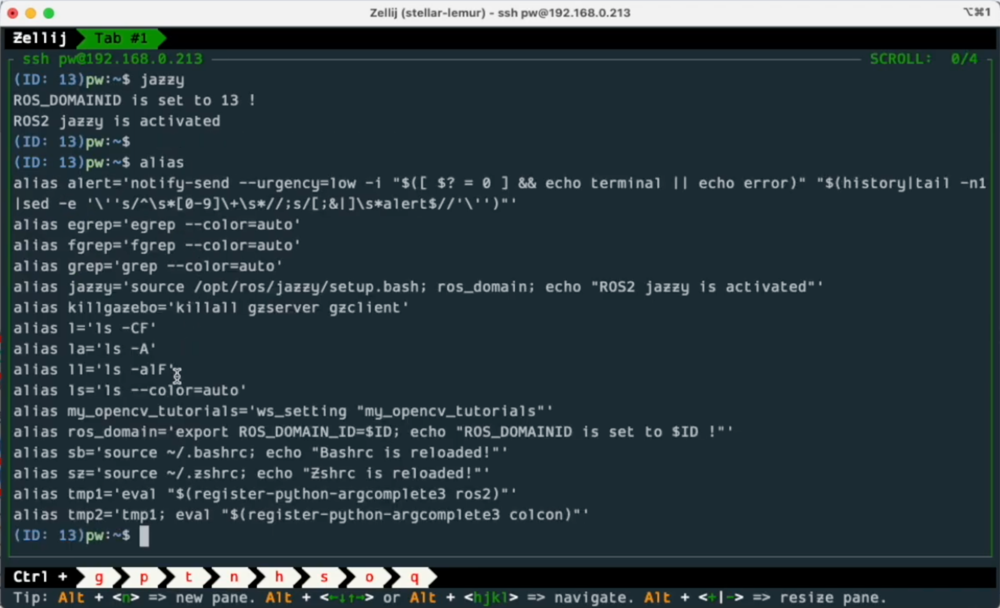 
저는 위 내용을 alias로 잡아두었기에 jazzy 하고 부르면 떠요 ! 

그러니까 ws_setting / rmf_ws 라고 하고, rmf_ws라고 이름 붙여줄게요. alias / rmf_ws라고 잡은 것은 
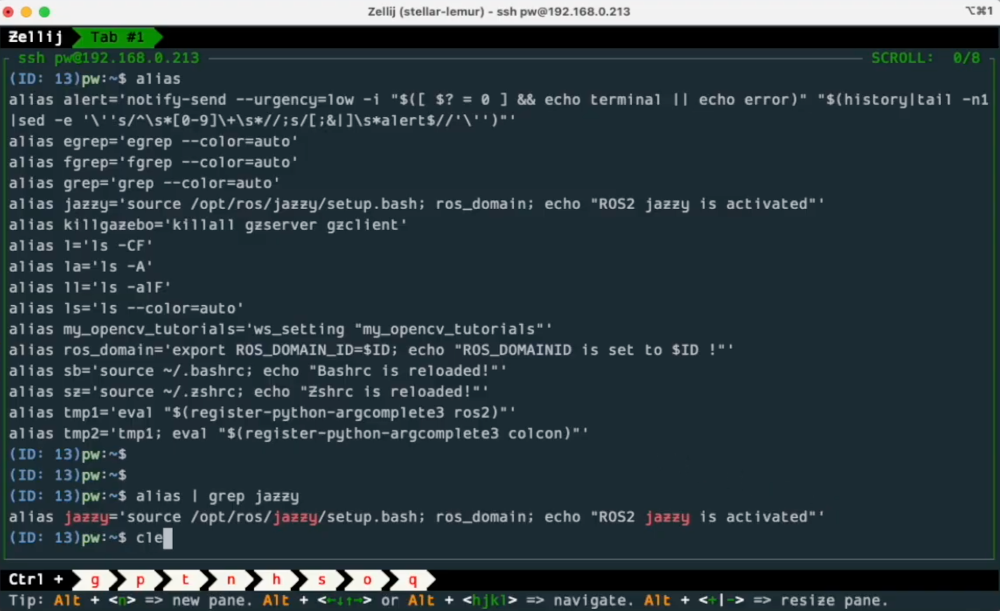 
alias가 궁금하신 분들은 여기서 grep 명령으로 "jazzy가 뭐니~?" 하고 불러보면 이렇게 돼 있어요. 

  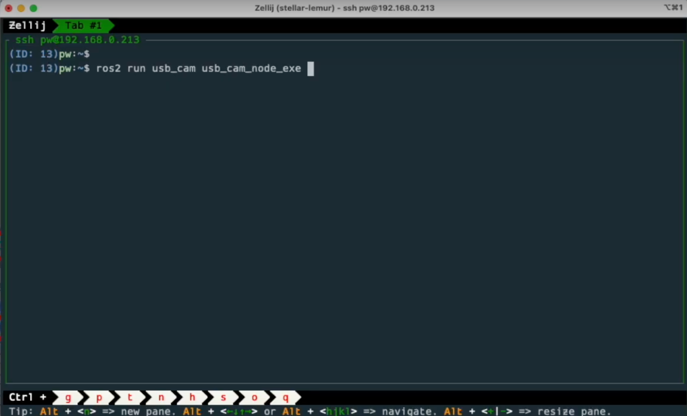 
  이 상태에서 ros2 run usbcam usb_cam_node_exe 해봅니다.

  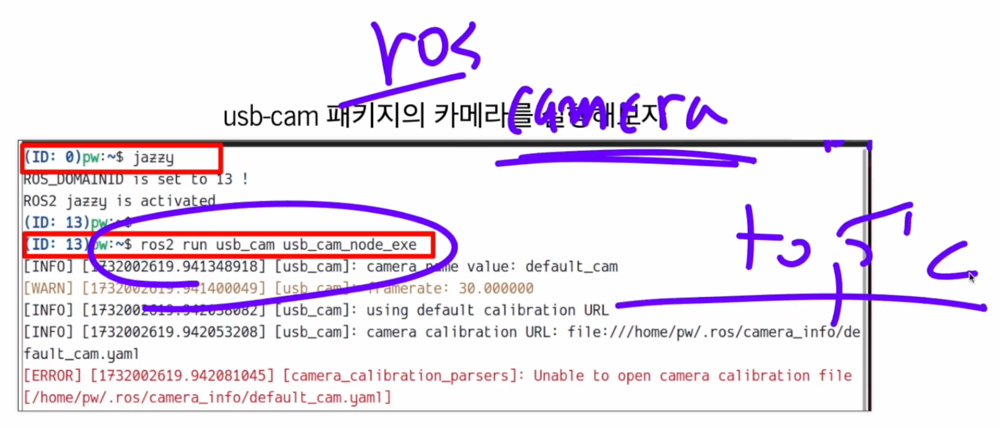 
영상이 안나와요! 왜냐하면, 이 명령은 카메라를 찾고, ROS에서 쓸 수 있는 카메라 토픽으로 발행만 해요. 
그러니까 내 얼굴이 아직 나오진 않아 토픽으로 발행만 하는거예요. 그럼 내 얼굴이 보고싶다! 그럼 어떻게 하냐면요....
이건 ssh에서는 잘 안된답니다! 

  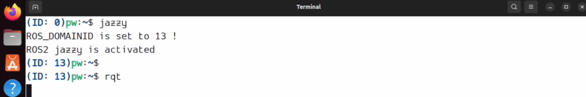 
다시 우분투 화면으로 가서, 똑같이 jazzy  라고 부릅니다. 
왜냐하면, 일단은 ROS_DOMAINID도 맞춰야하고 
opt/ros/jazzy/setup.bash도 불러야하구요. 
이 상태에서 rqt 를 실행합니다. 그러면!!!! 
 
  
  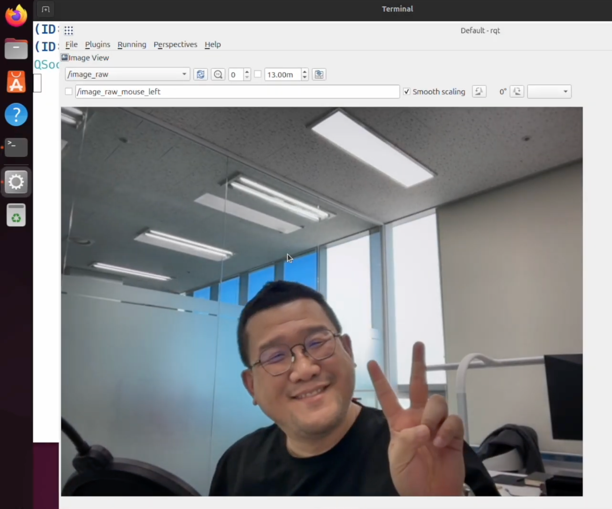 
 얼굴이나와요. (ㅋㅋㅋㅋ기임치이이이)
  

  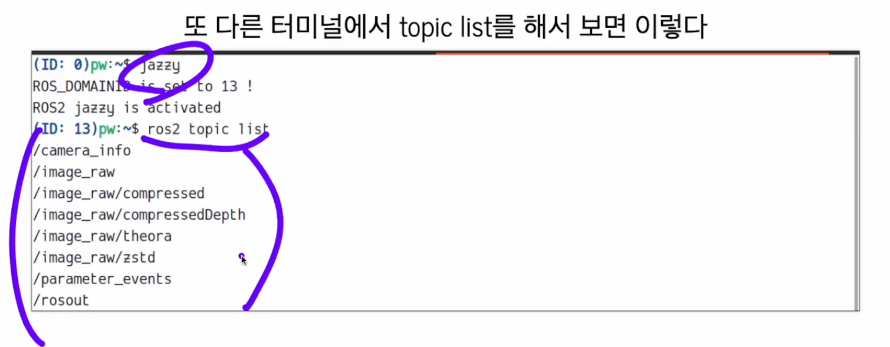 
사실 jazzy 부르고 ros topic list 에서 보면 이만큼 떠요. 
이것도 같이 봐요. 

  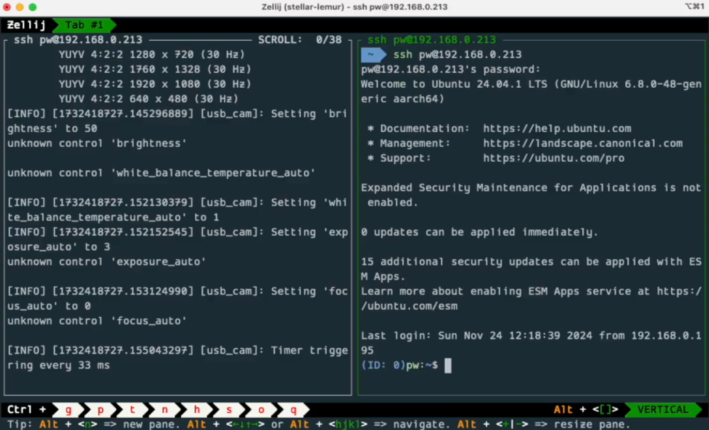 
이제 다른 터미널을 또 열어야겠죠. 여기에서 ssh로 
(이게 ubuntu랑 같은거래요! ubuntu pc에서 이 과정을 따라하고 계시면 ssh 접근을 하실 필요가 없답니다!) 

  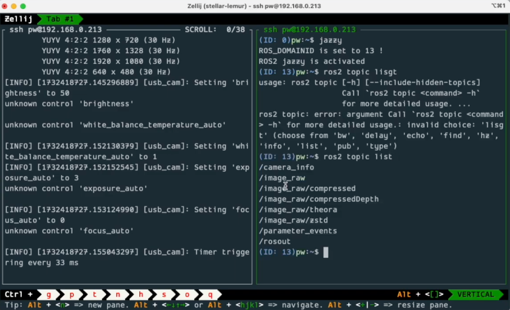 
여기에서 ros2 topic list 해서 보면 이렇게 이미지 raw가 떠요. 잘 나온다!

  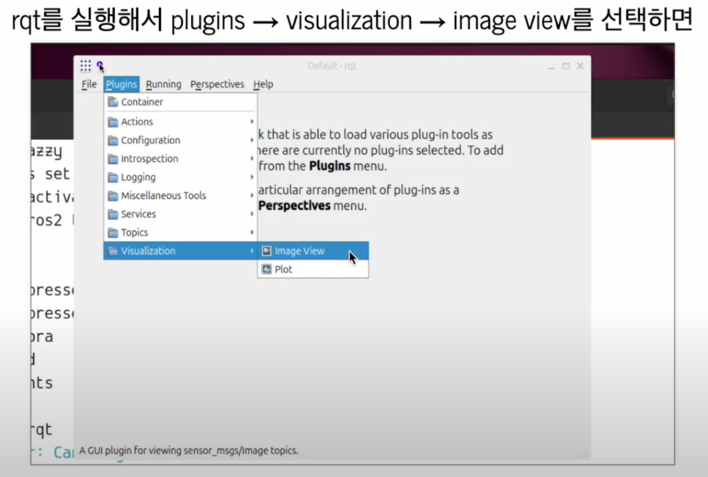 
아까 rqt 해서 봤던 게 이거에요. Plugins 에서 Visualization 에서 Image View 를 선택, 

  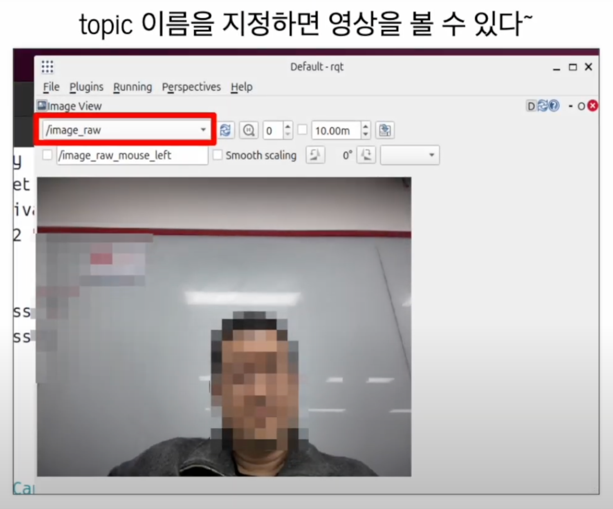 
/image_raw 해서 보면 나와요. 
현재 우리 수업은 ubuntu 24.04 기준이지만, 
22.04에서 동작을 해요. 
ubuntu에서 연결되어있는 usb 카메라가 있다면 얘한테 그냥 usb cam 이라는 패키지를 설치하고
(물론, 정식 이름은 ros jazzy 나 humble이 붙지만... )
usbcam이라는 패키지를 설치하고, usb cam exe node 를 실행하기만 하면 
카메라에서 받은 영상이 토픽으로 발행이 되는거에요. 그럼 난 그거 받아서 그냥 쓰면 되는거에요. 
그런데 ! 느려질 수가 있어요. 혼자 집에서 하면 그럴 일이 없는데, 
  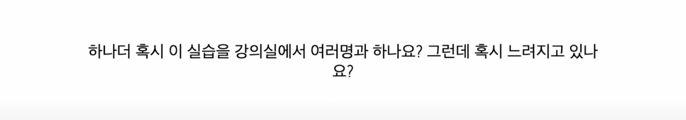 
강의실에서 몇 명이 모여서 혹은 스터디룸에서 몇 명이 모여서 카메라를 동시에 각자 켜면 
어? 좀 버벅거린다 하는 느낌을 받아요. 
카메라를 켠 사람이 나밖에 없어, 다 로스를 공부하고 있는데, 강의실에서 카메라를 켠 사람은 나밖에 없는데 
나 포함 단체로 느려지는 경우가 있는데요, 극ㄴ 
'멀티캐스트' 때문이래요. 이게 우리 dds를 쓴다고 했잖아요, 그 ros2 는 dds를 쓰는데 이게 뭐냐면 
예를 들면 내 pc가 있어요. 그리고 여러명의 pc들이 ros들이 막 깔려있어요. 
ros를 깔았다는건 다들 dts를 설치했다는 거죠. 그러면 토픽을 받아서 코드를 넣지는 않았는데, 
이 pc 에서 카메라가 막 가는거에요. 카메라가 생각해보면 640 곱하기 480 짜리 카메라라 하더라도 3색이잖아요. 
rgb, 그러니까 이제 곱하기 3이 들어가죠. 이것만 해도 용량이 꽤 될 겁니다. 
계산 좀 해 볼까요 ? 
계산기 컴온(ㅋㅋㅋㅋㅋ여기서 찐 빵....터졌답니다. )
640x480x3 = 10만
640x480x3x8/8/1024 = 900km
이거를 fps로 보내면 초당 30번이죠. 곱하기 30 하면 27메가. 그러니까 카메라 영상이 생각보다 용량을 많이 먹어요. 무슨 용량이냐면 내 피씨의 용량이 아니고 네트워크의 부화를 많이 일으킵니다. 멀티캐스트라 그래요. 
불특정 다수에게 막 쏜다, 받아야 될 후보군이 받겠다는 말을 안했는데도 쏘는거죠. 이것때문에 느려져요. 
그래서 단체로 실습을 하는데 내 피씨에서만 쓰겠다면 
요걸 한 번 살짝 넣어주면 된대요. 이렇게 터미널에서 export 명령어로 local host only = 1 이거 해석해주시면 됩니다. 이거 해 주시면 돼요. 요거 매번 하기 싫다라고 하면 또 alias 잡으면 되구요. 저 ros local host only 를 건다는 것은 네트워크를 통해서 로스 토픽을 밖으로 보내지 않겠다는 거에요. 내 pc 한정으로 쓰겠다는 거에요. 그러면 네트워크에서는 영향이 없죠. 근데 그렇게 되면 옆 pc와 다른 디바이스와는 통신을 못 하게 된답니다..! !
  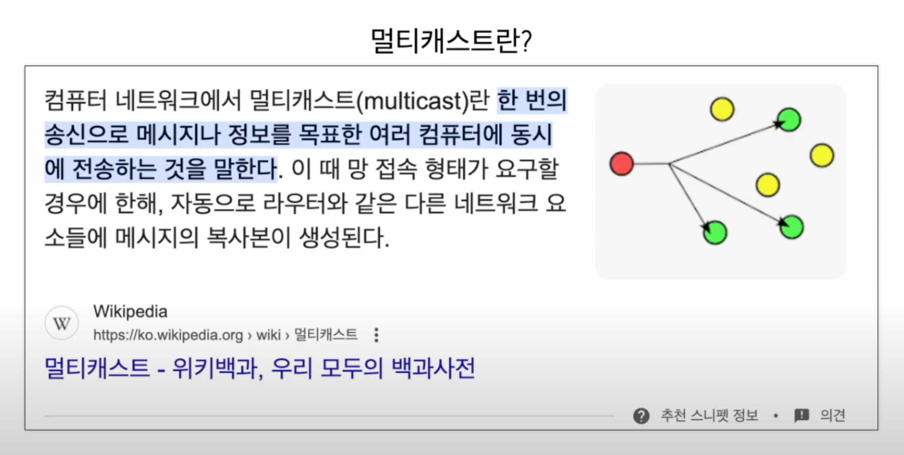 

  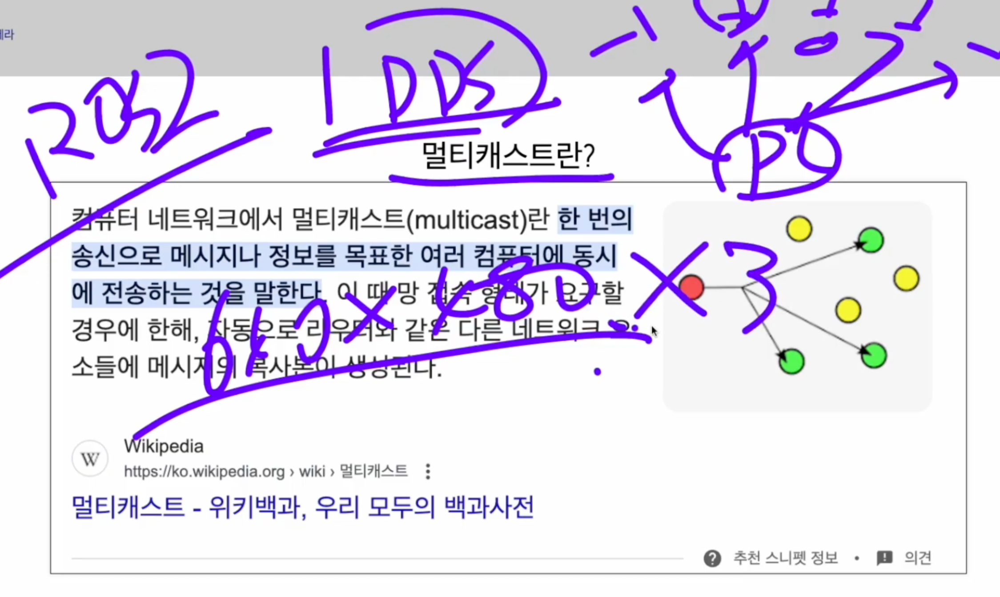 

  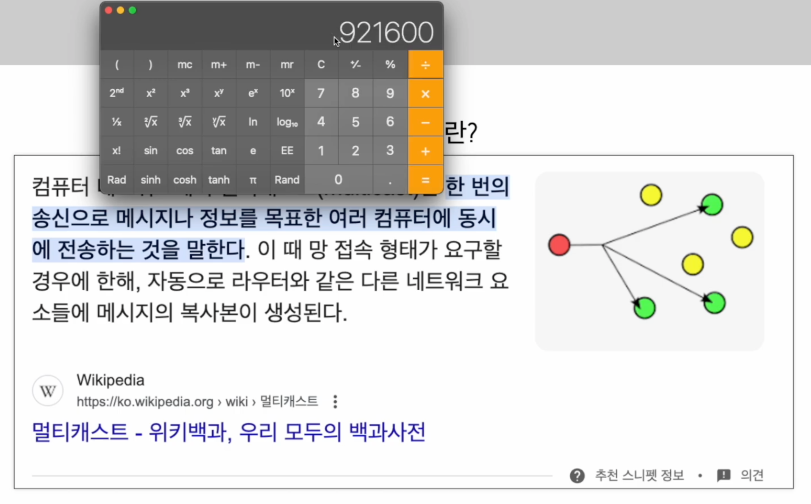 

   

  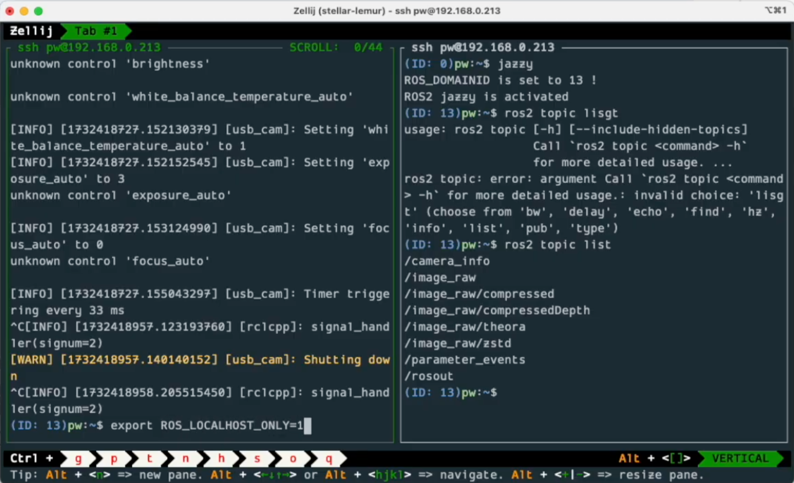 

   

   

  

