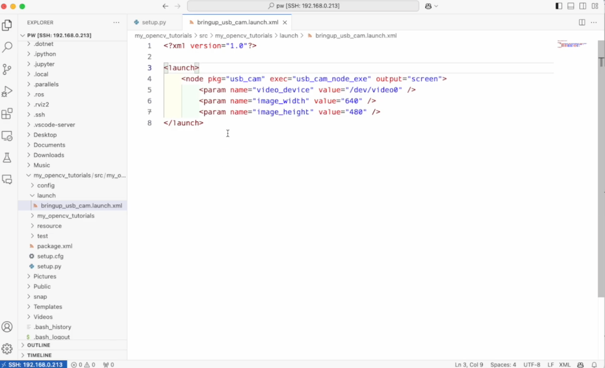
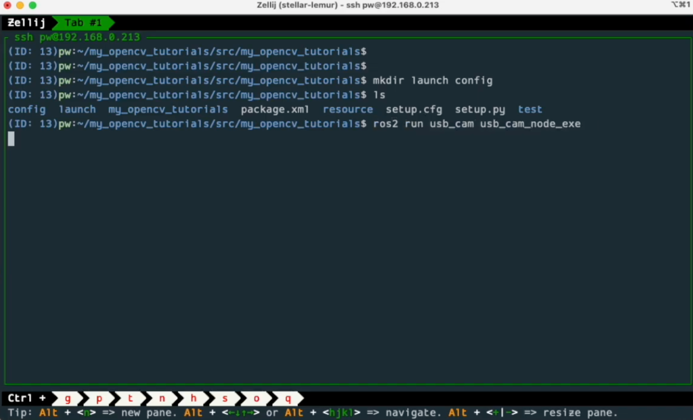
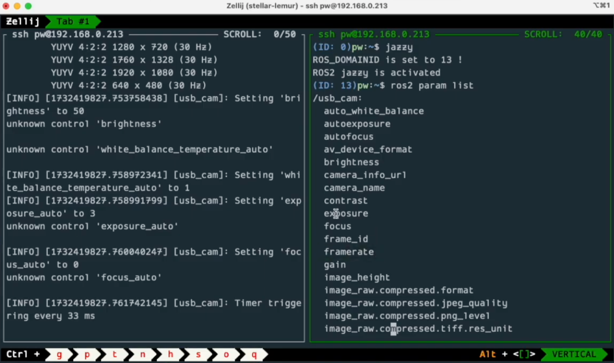
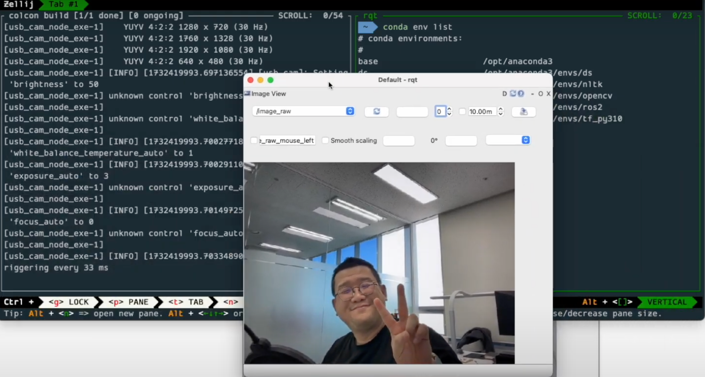

## ROS_DOMAIN_ID 그리고 local_host_only
### R2R 실전편! Rush to ROS 

  

   
DOMAIN_ID도 , LOCAL_HOST_ONLY 도 터미널 마다 확인을 해 봐야해요. 
확인을 할 게 너무 많아요!
  
  
   
이럴 때 해 주는게 있어요.  
bashrc에 작업을 더 넣어주는거죠. 지금 이 화면은 vs code 에요. 
강사님은 vs코드를 ssh 로 접근 한 거에요. 

여러 영상에서 언급 되었지만, 강사님은 mac 을 주 pc로 사용하시고, ubuntu를 개발용 pc 로 사용하시는데, 
그 사이를 ssh로 연결하는거에요. 

ubuntu pc에 직접 모니터, 마우스, 키보드를 연결해서 쓰시는 분들은 이런 거 고민 안 하셔도 되고요. 

ssh이건 아니건! bashrc를 열어요.  
 
   
그런데, 지난번 영상에서 bashrc를 직접 작업하는게 아니라
 
   
  
alias setting sh 파일을 열기로 했잖아요. 
여기에 이렇게 코드를 넣어둔 거에요. 

   
ROS_DOMAIN_ID가 없다면 
 
   
0이다.
   
그리고 ROS_DOMAIN_ID가 있다면 , 표기해라
   
함수로 만들었어요. get_status 라는 함수!
   
  그리고 ROS_LOCAL_HOST_ONLY가 없으면, 

   
0이다. 통신을 다른 pc와 하겠다는거죠. 
topic을 주고받겠다는거에요!

   
그게 있다면 (1밖에 없지만) 표현을 해라, 하고 함수로 이렇게 잡아둔 거에요. 

   
그게 이 내용이에요.
잠시 타이핑을 해 보신 다음에..
     
bashrc를 읽고, 
get_status 해 보시면 된답니다!

   
실제로 터미널 화면에서 적어봐요. 
너의 ROS_DOMAIN_ID는 13이고 LOCAL_HOST_ONLY는 0이네 하고
이런걸 하나 함수를 만들어 두면, 매번 입력할 필요는 없는거죠. 

*참고! 
echo$ ROS_LOCAL_HOST_ONLY 이것도 입력 해 두면 편해요. 

   
데이터 정말 많아요. 그래서 실제로는 줄여도 초당 기기 둘만 통신을 해도 1메가는 돼요. 
그게 아무리 줄여도 10대의 디바이스가 가져간다 하면 초당 10메가인거죠. 
그런데 인터넷 속도 말구요, 공유기가 커버할 수 있는 용량이 생각보다 높지 않아요. 
그러니까 네트워크 즉 공유기가 느려지는거죠. 이럴때 보통 많이 하는게.. 

   
강의실에서 다수의 팀이 프로젝트를 한다고 하면 
팀마다 공유기를 주면 된다 해요. 팀별로 이 공유기에서 활동을 하라는거죠. 
근데 그러면 강의실을 운영하시는 시설 팀이 스트레스를 좀 받으셔요. 
왜냐하면, 공유기 라인이 하나 들어오는데, 팀별 지급된 공유기랑 엮어야 되거든요. 
이것도 보통 일이 아니에요. 네트워크 관리가 되게 어려워져요. 
그래서 카메라에 대해서만은 토픽을 안 쓰는 분들도 되게 많아요. 

   
토픽 리스트에서 상세히 보면
이미지로도 있구요, 이미지로 컴프레스드도 있고 그래요. 
그리고 여기 보면 이미지의 데이터 타입이 이미지인 것도 있죠. 

 
이제 이걸 보고 간단하게 패키지 하나 만들어 봐요. 
jazzy 부르고 mkdir 명령어로 my_opencv_tutorials, 
이제부터 한동안 opencv를 이야기해요. 
src 폴더 만들구요,

   
그러고 난 다음에 거기로 이동해서 pkg create 명령어로 패키지를 만들어 볼 거에요. 
일단 강사님은 카피.... (우리는 타이핑!)

   
mkdir 명령어 다음 -p (p 옵션을 주고)
my_opencv_tutorials 에 src 폴더를 만들어라 했어요. 

cd my_opencv_tutorials/src/ 여기까지 간 다음에
jazzy는 불렀지만 한번 더 부를게요. 
(아직 humble 쓰시는 분들은 humble 하시면 됩니다.)

그리고 ros2 pkg create --build-type ament_python my_opencv_tutorials
(-> ros2 pkg create 빌드 타입은 ament python으로 잡았구요, my_opencv_tutorials 라는 이름으로 만들었습니다.)

ls 해서 보시면 나와있어요.
만들어 졌어요.
   
이제 이 상태에서, launch 랑 config 폴더를 만들 거에요. 
launch랑 config 폴더를 my_opencv_tutorials로 가서 만들도록 하죠.
 
  
   
my_opencv_tutorials로 가겠습니다. 
여기에서 mkdir 명령어로 launch 폴더랑 config 폴더가 여기에 만들어져 있어요.

  

   
이 상태에서, 아직은 config 폴더에 뭘 넣을 것이 아니라서, 런치 폴더만 대응을 하도록 할거에요. 
이 코드는 우리가 예전에 가지고 왔던 예전 응용편에서 많이 쓰던 코드에요. 

   
여기에 my opencv tutorials 가 있죠.

   
여기에 setup.py가 있습니다. 여기에 data_files 가 있죠. 

   
여기에 share 의 pakage_name, pakage name launch 잡아주시구요, 
import glob 부르구요, 
glob에서 os 레벨 명령어도 쓸 거라서, 
import os도 이렇게 해요. 
glob.glob(os.path.join('launch', '*.launch.*'))
( os한테 path join 하고 launch 하고 모든 가운데가 launch 인 아이. )

   
이 내용 타이핑 해서 넣었어요. 
    
그리고 launch 폴더에 bringup_usb_cam.launch.xml 추가하도록 할게요
   
이 내용이에요. 
   
여기에서 launch 폴더에 new 파일을 하나 열고 bringup_usb_cam.launch.xml 을 만들거에요. 
그러고 난 다음에 xml 이니까 xml 버전을 잡아줘야해요. 버전은 1.0 
코파일럿, 커서, 뭐가 되었든 괜찮아요.

그리고 node 를 하나 실행 할 거에요. 
pakage는 usb cam 에서 usb pkg 에요.
   

   

   

   

   

   

   

   

   

   

   

   

   

   

   

   

   

   

   

   

  

