## Bashrc
안녕하세요, 이번 시간에는 또 bashrc 이야기를 하려고 합니다. 잉 다 하신거 아닌가요? 하실 수도 있지만, 지루한 내용 반복해서 여러번 하기! 저의 수법입니다.
아직 못다 한 basrhrc 이야기가 크개는 하나, 작게는 두 개가 남아있습니다. 먼저 설치 이야기를 좀 해야되는데요,
  

  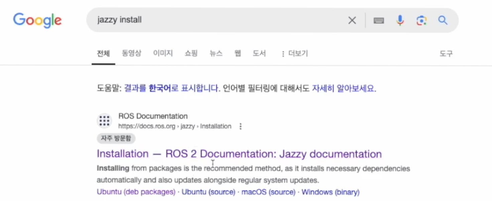 
  
  이렇게 검색창에 'jazzy install' 혹은 'jazzy' 라고만 쳐도 뜹니다. installation document 나왔어요.
  ROS는 버전마다 installation 페이지를 항상 제공을 합니다. 
  
  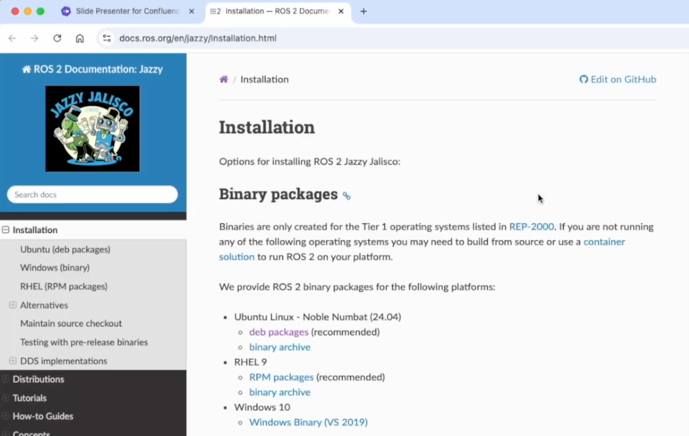 
  
  여기에 넘어가면 우분투 바이너리로 설치하는 과정이 나오는데요, 놀랍게도 별 차이가 없습니다. 
  
  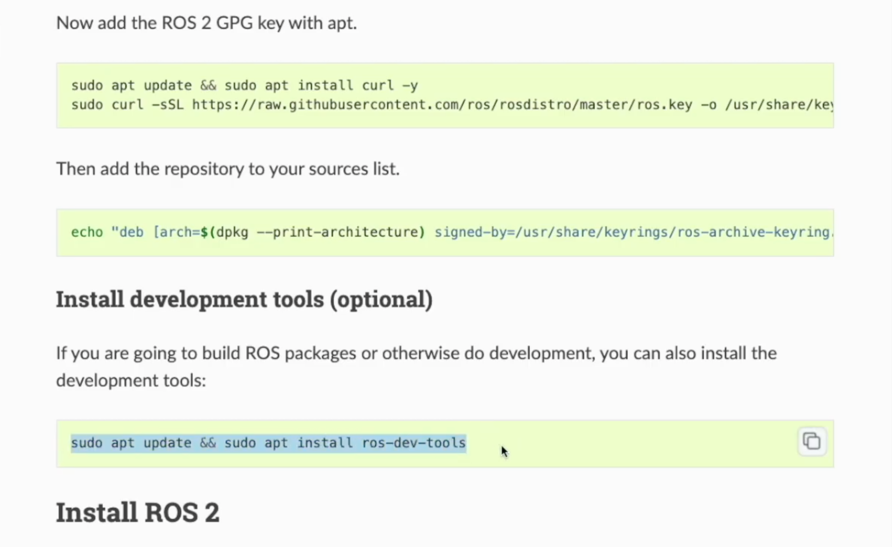 
  터미널에 < ctrl + c > 하시던지, 오른쪽 위의 네모버튼을 누르시던지 해서 터미널에 붙여넣기 하시면서 실행 해 가시면 됩니다. 
  
  * 혹시 잘 모르시는 분들을 위해 .. 
    1. 한 번 클릭 하면 ' 그냥 클릭 '
    2. 두 번 클릭 하면 ' 단어 선택 '
    3. 세 번 클릭 하면 ' 문장 선택 '
   이 됩니다. 

   터미널에 붙여 넣을 때에는 < ctrl + shift + v > 이렇게 붙여넣으시면 되구요. 
 Install ROS2 윗부분까지 < ctrl + c > + < ctrl + v > 하시면 됩니다. 

 
  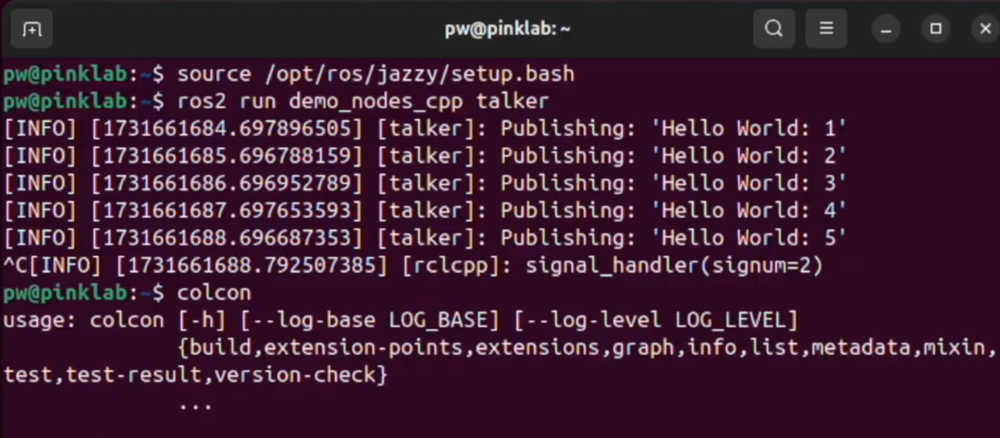 
  
이제 jazzy 버전 설치가 되었는지 확인 해 볼까요! 아직 소스 아무것도 안 했어요. 그러니까 설치 직후라고 생각하시면 됩니다. ^^
     source /opt/ros 경로에 이제 humble이 없어요. jazzy만 있어요. 
 
jazzy 에 setup.bash 부르고
 
ros2 run demo_nodes_cpp talker 이렇게 하면
설치 끝! 콜콘만 한 번 실행 해 볼까요 ? 
  colcon 하면 명령이 실행돼서 요런게 나온거에요. '너 저 문법 하나도 안 지켰는데 콜콘만 하면 어떡하니' 뭐 그런 내용이 뜬겁니다. 
  그래서 두가지 설치가 잘 됐습니다. 
  현재 이 페이지에서의 가정은, '우분투가 24.04이고 ROS2 jazzy 버전이 잘 설치 되었다' 입니다.
  

   
이제 이 상태에서 bashrc 이야기를 좀 할게요. 정말 길게 이야기했죠. 이해가 필요하거든요. 익숙해져야합니다.
   
그리고 예전에 우리 alias 이야기도 많이 했죠.  
   
  이제 그 이야기 좀 더 이어서 가 볼게요. sh 파일이 있습니다. 
  이게 어떤 파일인지 알려줄게요. 
   
    bashrc 직접 건드리는게 별로 좋지 않아요. 몇 개월에 한 분 정도는 만나요. 본인이 어딜 고쳤는지 모르는거에요. 지우거나 딴 데를 건드렸거나. 그래서 옆 사람에게 파일을 빌려오기도 합니다. 성격상 그걸 못 하시는 분들도 있어요. 그러면 예쁘게 포맷.. ! 그래서 bashrc 를 건드리는건 썩 좋은 일은 아닌 것 같아요. 급할 때는 하는데요, 저는 파일을 하나 만들어 둡니다. 
  
  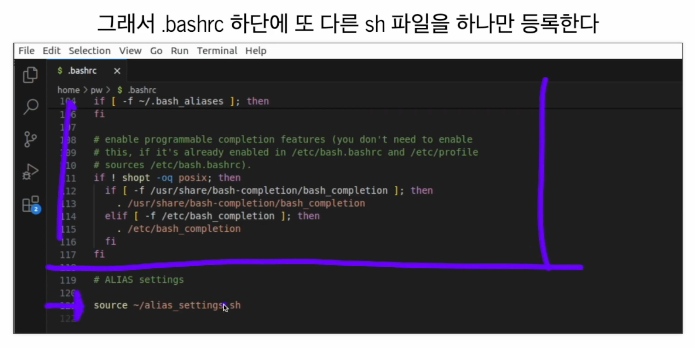 
  위의 이미지 내용이 bashrc거든요. bashrc에다가 alias_settings.sh 라는 파일을 만들어두고, 그걸 홈에다 둔 다음에, source 하도록 만들어 두는거에요. 
  그러면 여기까지가 bashrc의 내용이란 말이에요. 원래 bashrc의 디폴트 내용이죠. 나는 아래에 한 줄만 추가 한 겁니다. 그리고 이 파일에서 내가 하고싶은 이야기를 하는거죠.

  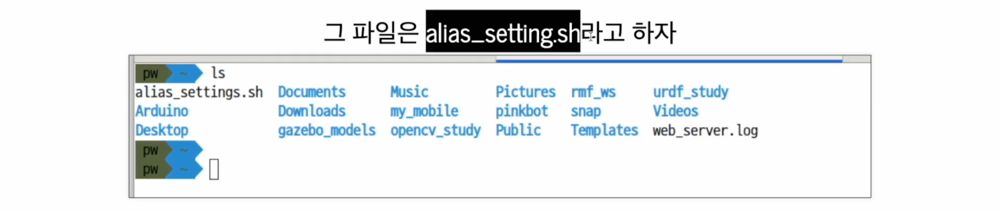 
  자 alias_settings.sh라고 하고 홈에 둔거죠. 
  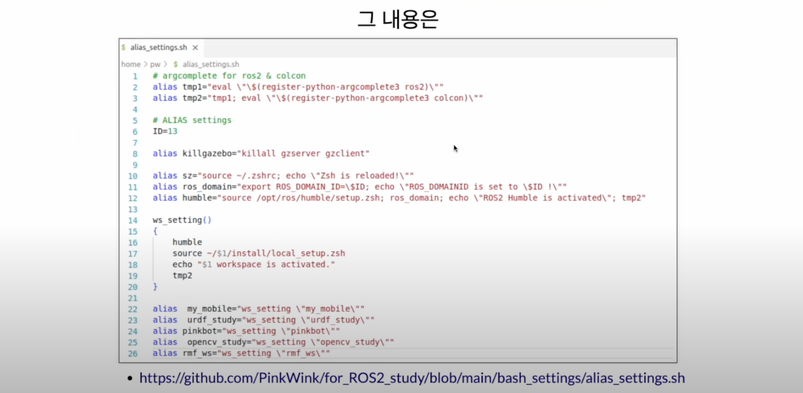 
  그리고 그 내용은 대충 이렇습니다. 이건 여러분들이 타이핑하시기 어려울 것 같아서 카피 해서 넣어뒀어요. 깃허브에서요. 
  https://github.com/PinkWink/for_ROS2_study/blob/main/bash_settings/alias_settings.sh

이건 제가 좋아하는 스타일입니다. 이 파일은 humble 기준으로 작성이 되어 있어요. opt ROS 의 humble 버전을 불러온단 말이죠. 

  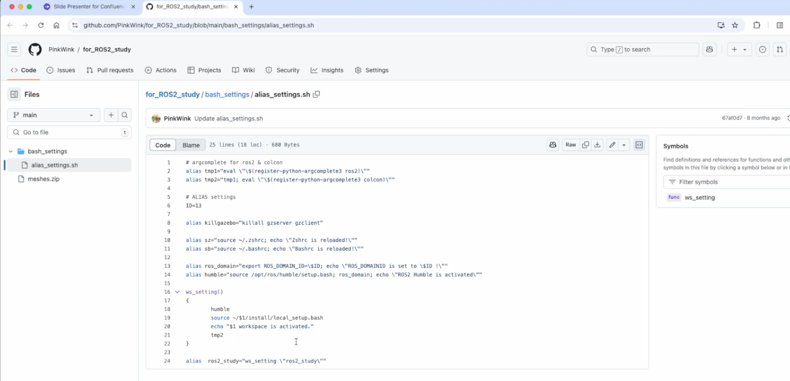 
여러분들이 지금 jazzy를 쓰신다면 여기를 humble -> jazzy로 바꾸시면 됩니다. 
  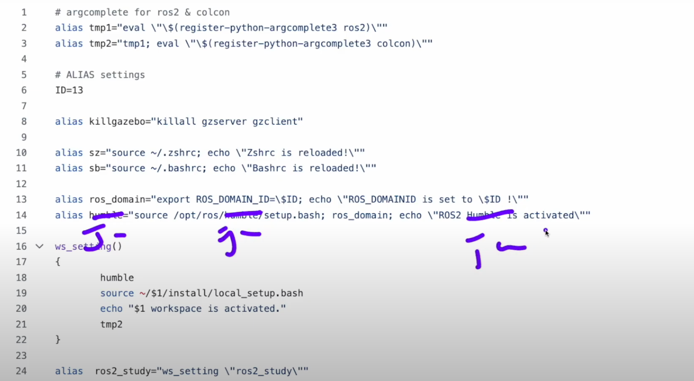 
이 파일을 alias_settings.sh라고 두는거죠.

  자, 그럼 이 많은 내용들은 다 뭐냐! 
첫 두 줄 부터 설명 해 볼게요, 

  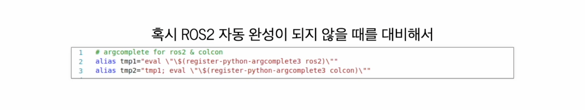 
서두에... 
저는 pc가 여러대가 있어요. 하나는 수업용 자료를 만드는 pc에요. 항상 포맷합니다. 항상 처음부터 시작해서 코드가 이상이 없는지 점검하거든요. 근데 항상 포맷을 할 수가 없잖아요. 그래서 개인 pc가 따로 있습니다. 근데 여기가 우분투용 pc이긴 한데, 사실은 설치한게 민트에요. 저 리눅스 민트 엄청 좋아하거든요. 리눅스 민트를 설치 해 둔거에요. 그런데 리눅스 민트의 한가지 문제가, ROS2에서 Tap 누르면 자동완성되는 그 기능이 잘 안 될 때가 있어요. 그것때문에 여기에 넣어 놓은 거에요. 이게 그걸 잘 잡아주거든요. 
  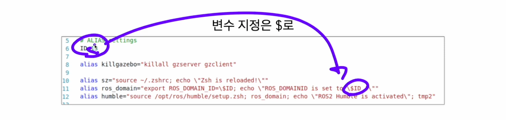 
그리고 이런 것도 좋아해요. ID를 변수로 선언해서 사용하는 걸 좋아합니다. 
이렇게 하면 내가 ID를 바꿀 때, 여기를 찾아다니면서 안 바꿔도 되거든요. 그래서 달러 기호에 ID 해두면 저는 이 자리만 바꿔주면 되는거죠. 이게 '변수 지정' 입니다. 

  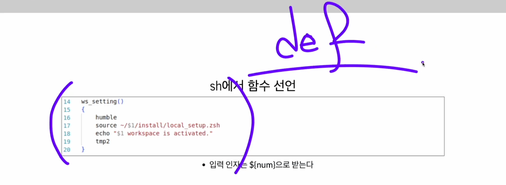 
  또 하나 있습니다. 이게 이제 sh 파일에서 함수를 선언하는 기능이에요. 파이썬에서 df 함수를 선언하는 기능이 또 있어요. 이게 뭐냐면, w setting 이라는 함수를 쓰면 humble 을 부르고, 그러고 난 다음에 소스 명령어로 여기에 함수를 사용할 때 입력 인자가 있을 거잖아요. 이걸 여기다 넣으라는 거에요. 그걸 그렇게 해서 만들고 에코로 만들어줘라. temp2는 뭐냐면, 아까 자동 완성한다던 것 때문에 읽는 거구요, 그래서 자동완성 잘 되시는 분들은 넣을 필요가 없어요. 
자 이렇습니다. 이게 함수 선언이에요. 그럼 이걸 어떻게 쓰느냐, 밑에서 보시면 됩니다. 
  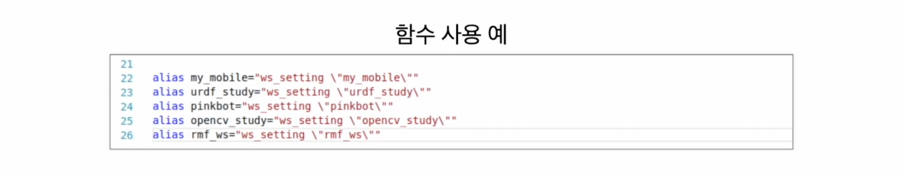 
  이렇게 씁니다. 

그러니까 ws_setting / rmf_ws 라고 하고, rmf_ws라고 이름 붙여줄게요. alias / rmf_ws라고 잡은 것은 
 
 괄호 안에 rmf_ws 를 넣으면 < $1 > 들이 다 바뀌게 되는거죠. 
 이렇게 함수로 선언 해 놓고 workspace를 만들 때 쓰는 그 alias를 잡아주면 좋은거죠.  

  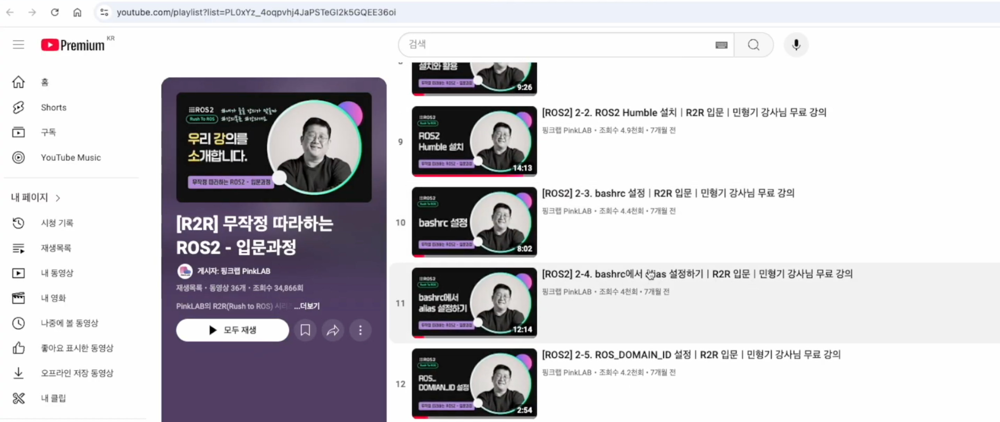 
지금 제가 설명하고 있는 alias 의 내용이 이해가 잘 안되신다면, 꼭 R2R ROS2 PinkLab 여기로 가셔요. 여기에 가셔서 bashrc 설정, bashrc alias 설정, ROS_DOMAIN_ID 설정 까지 보고 오시면 이해가 잘 될거에요.

  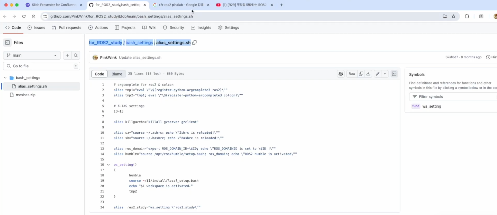 
  PinkWink Github - Repositories - for_ROS2_study 를 찾으시면 됩니다. 
bash_settings - alias_settings.sh 이 파일이 있어요. 

  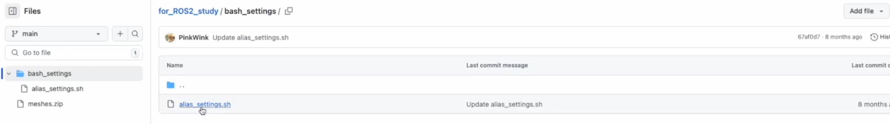 
  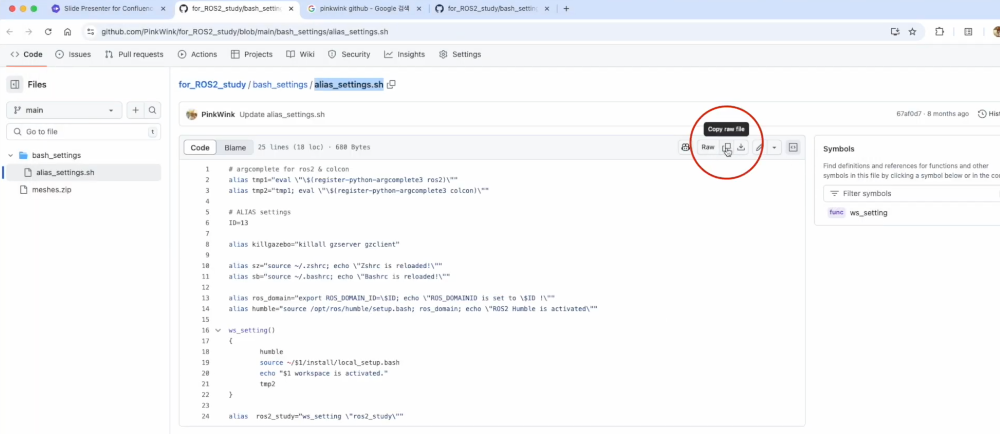 
   Git 내용을 카피해서 넣을거에요. 

  
  ( 검색해서 제목만 보고 오셨다면, 어느정도 ROS나 ubuntu 에 익숙하시리라 보고, 
  VS Code, Cursor, Sublime Text 어느 것을 사용 하셔도 괜찮아요. ) 

  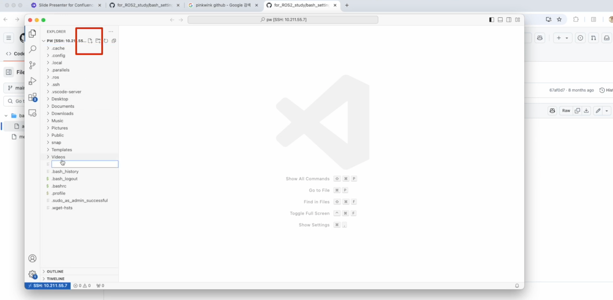 
  새파일 만들기에서, 제목은 alias_settings.sh로 만들어 넣어요.

  
  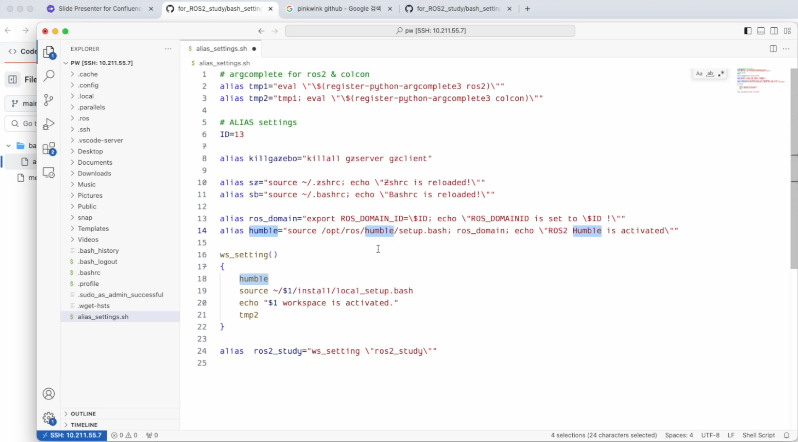 
  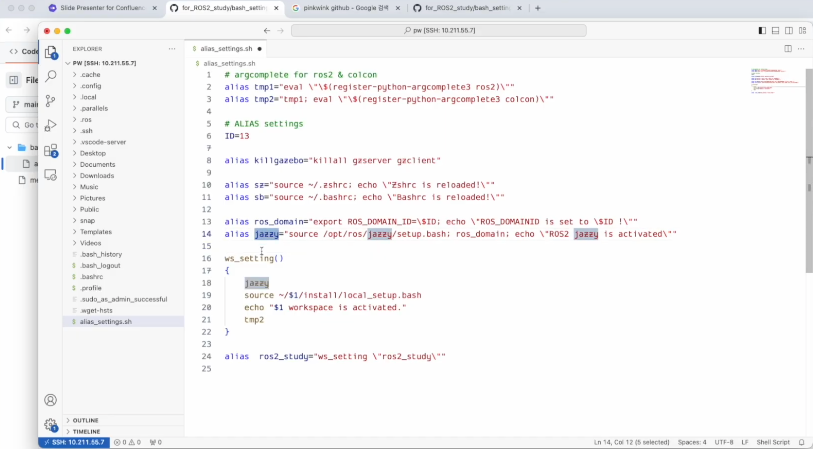 

  험블을 사용하시는 분들은 그대로 쓰시구요, 
  만약에 jazzy로 바꿨다, 하시면 humble 만 찾아서 jazzy로 바꾸고

  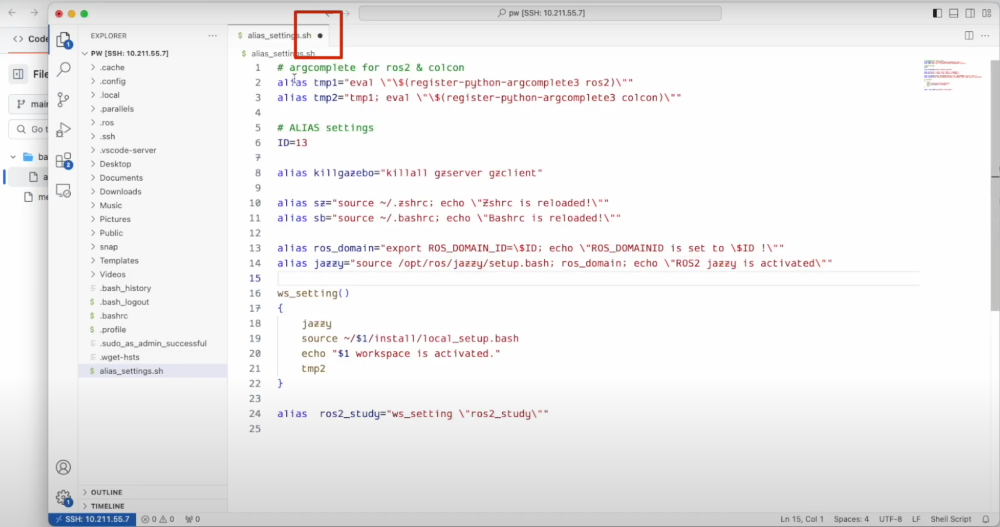 
  저장 하면 됩니다.
  이제 잘 적용 되었는지 확인 해 보도록 하죠. 
  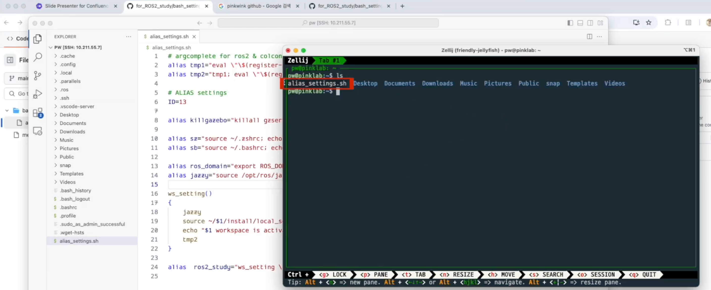 
  여기 alias_settings.sh 보이죠, 
  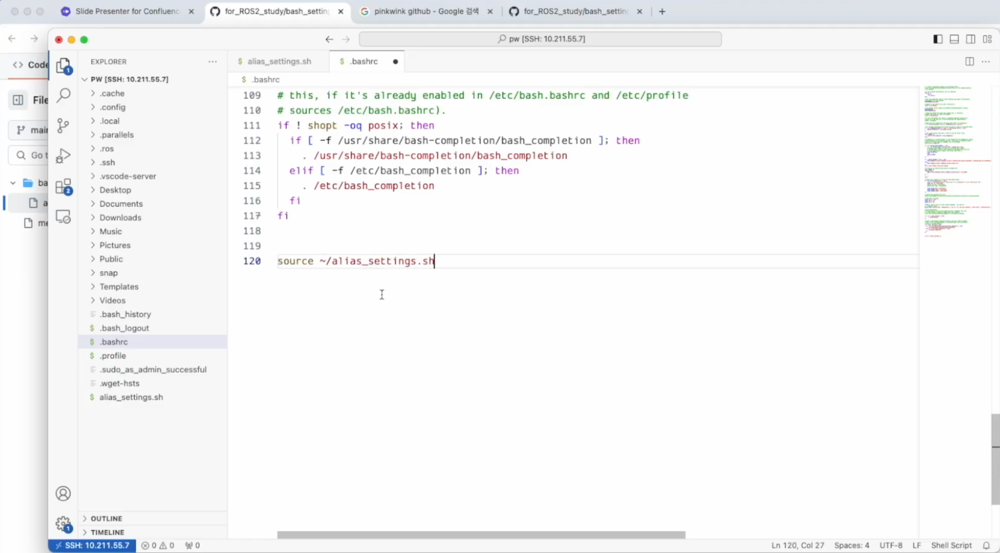 
  vscode 에서 명령어로 source ~/alias_settings.sh 적어주면 됩니다. 저장!
  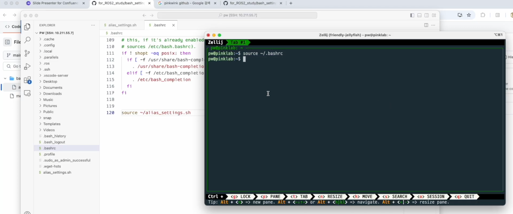 
  이제 홈에 있는 bashrc 읽어라 하고 터미널에 source ~/.bashrc 적어주고
  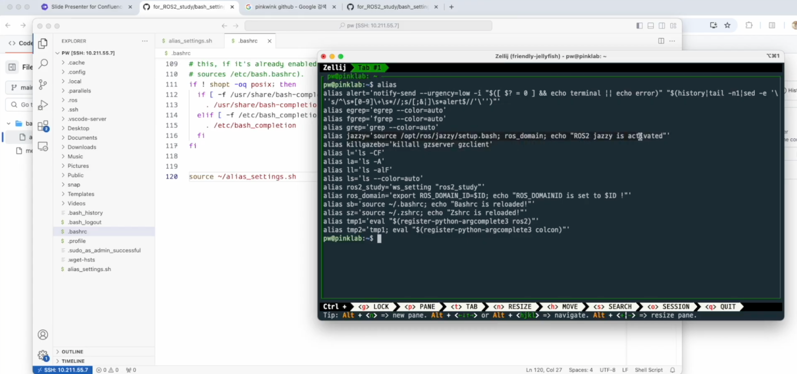 
  alias 관찰 해 볼게요. 
  ros2 study 보이고, jazzy alias 보이죠. 그럼 이제 한번 써 볼게요.
  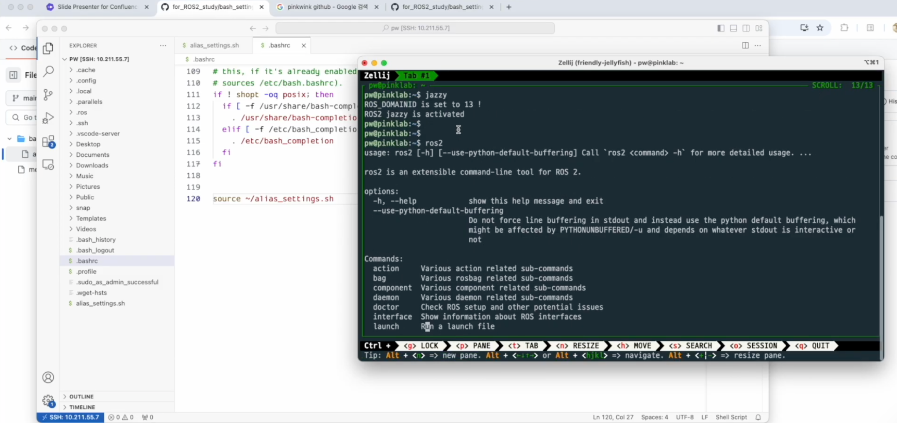 
  jazzy 하면
  ros domain id 뜨구요, 
  activated 뜨네요. ros2 명령이 적용 되었어요. 
  자 여기까지 하면 alias 이야기 하나 했구요, 

   
  작은 이야기 하나 더 해 볼게요. 

  중요한 문제가 하나 있어요. 
  이것도 이야기 한 적이 있긴 한데, 
  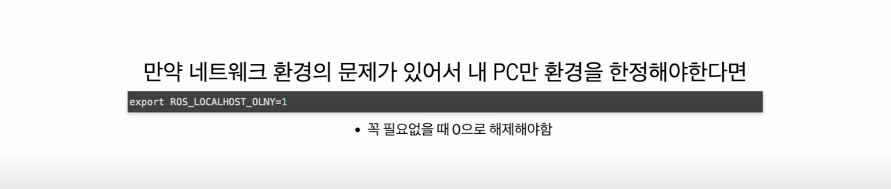 
  네트워크 문제가 있어서 내 pc에서 topic이 밖으로 안 나가게 해야한다, 
  그러면 ROS_LOCALHOST_ONLY=1로 설정 해야하구요, 이것도 bashrc나 alias_settings.sh에 넣어주면 됩니다.

  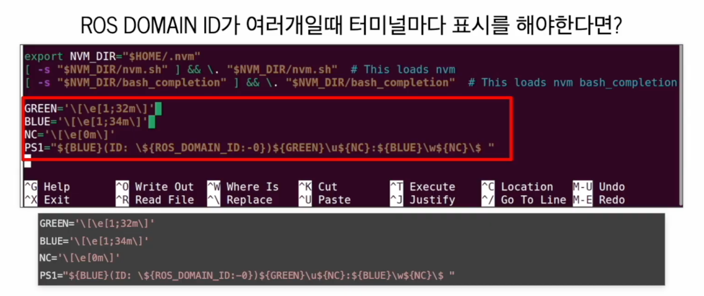 
  하고싶은 이야기는 이거에요. 
  Rasberry Pi 나, 여러 device 들이 네트워크로 연결되어 있는 경우에, ROS_DOMAIN_ID 가 여러개 만들어진단 말이에요. 
  그럼 내가 주로 작업하는 main pc 에 터미널이 네 개가 떠있고, 각각 DOMAIN_ID가 다르면, 나중에 헷갈립니다. 
  그러면 ' ROS_DOMAIN_ID 를 쉽게 보여주는 방법이 없을까? ' 
  이게 이번 주제입니다.

  이건 색상과 글자, 자간을 설정하는 터미널 명령어에요. 터미널을 예쁘게! 진작에 알았더라면..!
  사용자ID, 초록색, User ID,, 이런 것들이에요. 

  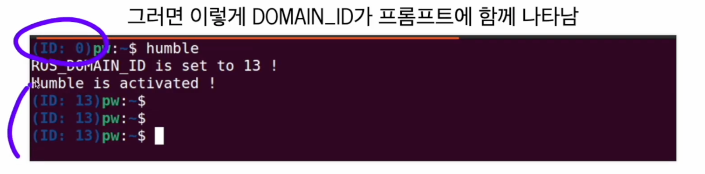 
  잘 셋팅하고 나면 이렇게 떠요. 내가 셋팅을 안하면 ROS_DOMAIN_ID 는 0 이에요. 
  setting이 되고나면 앞에 13 보이죠, 예쁘게 숫자가 떠요. 
  저는 USER_ID 만 초록색 pw로살짝 들어가있네요. 

  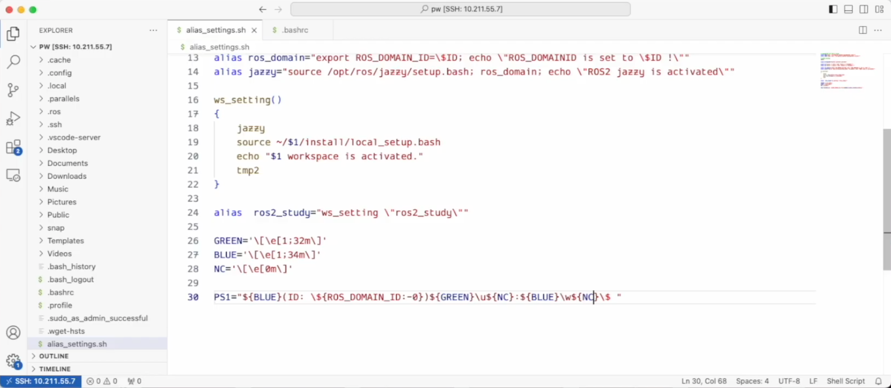 
  GREEN= , BLUE=, NC=, PS1= 되어있는데요,
  저는 PS1= 중괄호 안에 BLUE, ROS_DOMAIN_ID, GREEN, NC, BLUE, NC 차례대로 적어넣었어요. 

   참고! ID:-0 요건 '없다면 0을 넣어라' 예요. 

   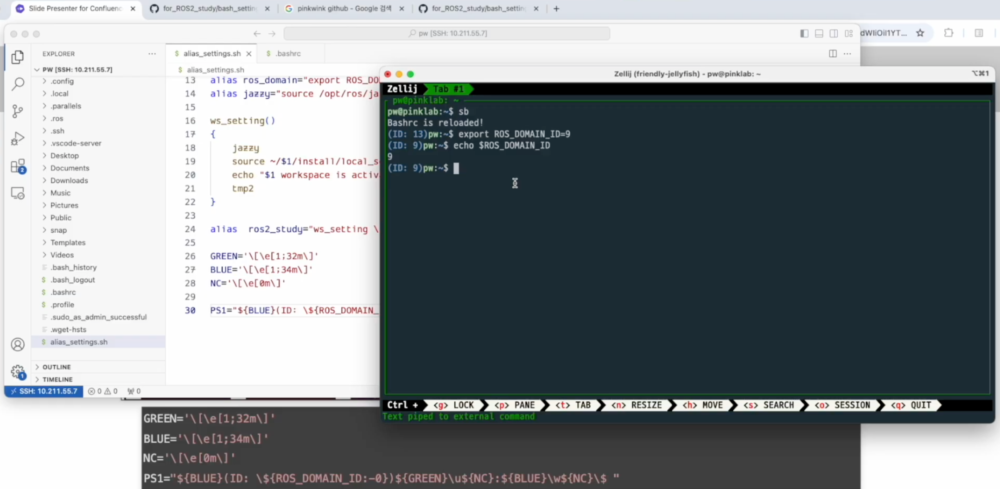 
   sb는 source bashrc 줄임말! 다시 불러오면 DOMAIN_ID 호츨 되어 뜨죠. 
   export ROS_DOMAIN_ID=9 하면 ROS_DOMAIN_ID 바뀐게 보일거예요.
   echo $ROS_DOMAIN_ID 해서 부르면 9 라고 뜨죠. 

이제 bashrc는 안녕!! 

고생하셨습니다!
  

